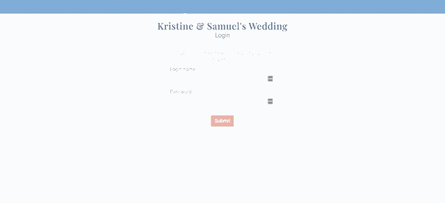

# Kristine & Samuel's Wedding

This is a personal wedding website to provide our wedding guests with wedding details and to collect and manage guest contact information and RSVPs. The goal was to build a responsive website with our own look & feel that would have a seamless UX/UI.

Back-end respository: https://github.com/kadrianne/wedding-website

## Built With
Frontend: HTML, CSS, JavaScript, SASS, Bootstrap, Foundation Building Blocks 
Backend: Ruby v2.6.1, Rails API v6.0.2.2, PostgreSQL v12.2

## Features

### Login validation

### Authorization to view RSVP Page

### Guest Information and RSVP

Once logged in, a user can view guest and rsvp information by clicking "guest rsvp" in the menu. Here the guests associated with the household tied to the users login will be displayed on this page as cards. The user is able to edit each guest's information as well as RSVP for each guest on the guest card. The updates are rendered optimistically and are also persistent on refresh of the page.

### Sticky Header and Image Slider

### Admin Dashboard

## Future Implementation
- Deployment to production server
- Authorization on all pages based on login/admin access
- Contact form with email integration
- Validation and error handling for add/edit forms